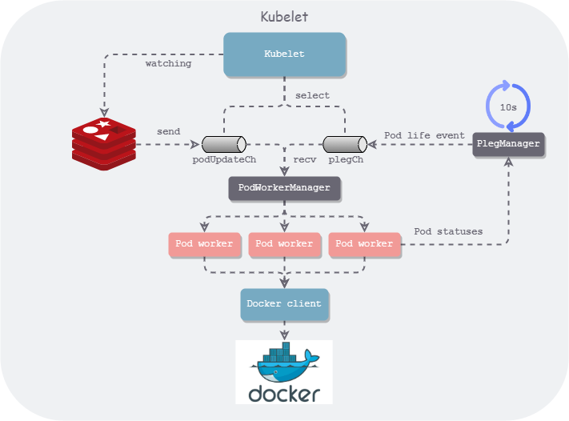

# Minik8s

## Description

Group project of SE3356 Cloud Operating System Design and Practice, Spring 2022.

## Structure

### Kubelet

The structure of `kubelet` in minik8s is similar to k8s, but it's greatly simplified.

### Pod Resources Monitor

The pod resources monitor is based on `cAdvisor`, `Prometheus` and `Grafana`.

We recommend you to use grafana dashboard with UID `11277` and `893`.

Here is a good reference: [Build up Prometheus + Grafana + cAdvisor](https://blog.51cto.com/jiachuanlin/2538983)

#### Hint

Because all these components are running in containers, so you can't access other running component by simply
using `localhost`(Even if they are running in `host` network mode).
Please use the ip instead.

## GPU support

See:
+ https://github.com/SJTU-HPC/docs.hpc.sjtu.edu.cn
+ https://docs.hpc.sjtu.edu.cn/index.html
+ https://docs.hpc.sjtu.edu.cn/job/slurm.html
+ https://studio.hpc.sjtu.edu.cn/

## Tools

For `windows`, we have `Docker Desktop` to monitor the stats of all containers.
But in linux, we don't have such convenience.

Fortunately, `portainer` performs even better than `Docker Desktop`.
It can be deployed easily by using docker. You can type `./portainer-run.sh` to start the portainer.
Then you can access it at http://localhost:9000.
