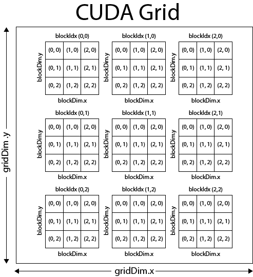

# Minik8s

## Description

Group project of SE3356 Cloud Operating System Design and Practice, Spring 2022.

## Structure

### Project overview


#### Dependencies
<ul>
<li>gin: <a href="https://github.com/gin-gonic/gin">https://github.com/gin-gonic/gin</a></li>
<li>cobra: <a href="https://github.com/spf13/cobra">https://github.com/spf13/cobra</a></li>
<li>cast: <a href="https://github.com/spf13/cast">https://github.com/spf13/cast</a></li>
<li>gjson: <a href="https://github.com/tidwall/gjson">https://github.com/tidwall/gjson</a></li>
<li>go.uuid: <a href="https://github.com/satori/go.uuid">https://github.com/satori/go.uuid</a></li>
<li>etcd: <a href="https://github.com/etcd-io/etcd">https://github.com/etcd-io/etcd</a></li>
<li>table: <a href="https://github.com/rodaine/table">https://github.com/rodaine/table</a></li>
<li>goph: <a href="https://github.com/melbahja/goph">https://github.com/melbahja/goph</a></li>
<li>redis: <a href="https://github.com/go-redis/redis">https://github.com/go-redis/redis</a></li>
<li>goquery: <a href="https://github.com/PuerkitoBio/goquery">https://github.com/PuerkitoBio/goquery</a></li>
<li>yaml: <a href="https://github.com/go-yaml/yaml">https://github.com/go-yaml/yaml</a></li>
<li>testify: <a href="https://github.com/stretchr/testify">https://github.com/stretchr/testify</a></li>
<li>go-iptables: <a href="https://github.com/coreos/go-iptables">https://github.com/coreos/go-iptables</a></li>
</ul>

### Architecture
The main language of our project is `golang`. The reason we chose `golang` is that the whole 
ecosystem of `docker` and `k8s` is based on it. Also, `golang` is now a very mature language, and has 
a good ecosystem, which means that we can use the libraries developed by others easily. What's more, it is also 
efficient in development, thanks to its language features.

For the implementation of some function, using `golang` is too heavy, so we choose to use `shell`. For example, we 
use many shell scripts in the development of `service`. And for some tiny jobs like starting a specified container, 
shell is more suitable.

In the whole system, `listwatch` is a very important function, it's based on message publishing and message watching.
So, we need a message middleware, and we finally chose `Redis` because it's simple enough(message middleware is not the 
key point of the system) and we are all familiar with it.

The overall architecture is similar to `k8s`. We implement `api-server`, `scheduler`, `controller-manager` in control 
plane, `kubelet` and `kube-proxy` that are running in a node, and a command line tool `kubectl`, which provides commands
for controlling the system and knowing about the status of it.

All the components will be compiled as independent parts. The components of control plane will be running in the
master node, while the other components like `kubelet` will be running on a certain node.

We have applied for 3 cloud hosts for our project, one as both master and worker node, and the other two as worker nodes.

### Node

`Node` here refers to `worker node`. `Pods` will be scheduled to any suitable node.

#### Node registration
We provide two ways to register a node to the control plane. One is using `kubectl apply -f` command that will
parse a given yaml file specifying the attributes of a node, another is registering automatically by `kubelet`.

For the first method, here is an example:
```yaml
kind: Node
metadata:
  name: node
  namespace: default
ip: 0.0.0.0
```

#### Node monitor

`Node controller` is responsible for monitoring node statuses. The status of a node contains a field standing for the last
time the node was synchronized with the system. And the controller will calculate the difference of current time and 
the last synchronization time. According to the difference, the node will be marked as `Ready`, `Unhealthy`, and `Unknown`.

If a node keeps `unhealthy` for a certain time, it will be considered `unknown`. All the pods on such node will
be removed, and all the metadata of it will be removed from `etcd`. Therefore, the scheduler will no longer schedule pods
to such node, because it won't be able to get the information of this node.

#### Heartbeat

To stay connected with the control plane, the `kubelet` in a node will periodically publish the status of the node, as
a kind of heartbeat. The `controller-manager` will watch the messages and store statuses of node in its own cache. The
`node controller` can then fetch the statuses and do its job. 

Once there is a network partition and the heartbeats can not be sent to the control plane timely, the node will be 
considered unconnected and the pods scheduled to this node will be removed in order to recycle resources and immediately
schedule the pods to the other available nodes to keep the service working.

### Kubectl

`kubectl` is a command line tool that helps user controller `minik8s`. It's similar to `kubectl` in `Kubenetes`, but
it's simplified and different in some commands. It is also based on `cobra`.


We support basic command like `kubectl get pods`, `kubectl apply -f xxx.yaml`. For more info,
see [kubectl README](/kubectl/README.md).

### Kubelet

The structure of `kubelet` in `minik8s` is similar to k8s, but it's greatly simplified.


#### Control flow

A pod will be created in many cases, manually using `kubectl` command, `replicaSet` maintaining `replicas`,
creating `function` instance, etc. All of them will call apis provided by `api-server`. `Api-server` will handle created
pods by publishing a `update message`(of type `entity.PodUpdate`) to a topic.

On the other side, `kubelet` will be watching on the topic and receive the message from `api-server`.
The message will then be passed to `pod worker manager`. It will create corresponding `pod work` and dispatch it to
a worker. 

The worker can interact with docker through methods provided by `runtime manager`. `Runtime manager` is responsible for 
interacting with docker through docker client. It exposes apis for creating/deleting a pod, 
creating/deleting a container, pulling images, etc.

`Status manager` is responsible for fetching the statuses of pods through apis provided by `runtime manager`, and 
storing them in a cache. It will periodically do full synchronization with `api-server` to keep the cache consistent
with the whole system.

`Pleg manager` is responsible for monitoring the statuses of pods and creating corresponding `ple`(namely **Pod Life
Event**). The statuses come from the cache maintained by `status manager`. And a `ple` will be pushed into a channel called
`plegCh`. Then the `ple` will be received by `pod worker manager` and it will create corresponding pod work and dispatch it 
to a worker.
#### Core: How to create a pod

Start an infra container first(default image is `registry.aliyuncs.com/google_containers/pause:3.6`). The infra
container provides network namespace and volumes for all the other containers. So they can communicate with each other
through `localhost` and share same volumes. The infra container is responsible for creating the `port bindings`
and `volume mounting`.

Here is an example of pod:
```yaml
apiVersion: v1
kind: Pod
metadata:
  name: pod
  namespace: default
  labels:
    app: myApp
spec:
  restartPolicy: Always
  containers:
    - name: viewer
      image: dplsming/nginx-fileserver:1.0
      ports:
        - containerPort: 80
      volumeMounts:
        - name: volume
          mountPath: /usr/share/nginx/html/files
    - name: downloader
      image: dplsming/aria2ng-downloader:1.0
      ports:
        - containerPort: 6800
        - containerPort: 6880
      volumeMounts:
        - name: volume
          mountPath: /data
  volumes:
    - name: volume
      hostPath:
        path: /pod
```

The pod contains two containers. One for downloading, and another for browsing downloaded files. Notice that they need
to expose ports `80`, `6800` and `6880`(In our design, if you only specify the `containerPort` field, the container will
choose random available port for binding). The infra container will be responsible for the port bindings(the two
containers should do nothing about port bindings, because it's all done by the infra container).

Both containers need a volume called `volume`, so the infra container will mount volume for them.

All these two containers need to do is to join the namespaces created by the infra container.

Here is a part of code about creating a common container. Please pay attention to the `NetworkMode`, `IpcMode`
, `PidMode` and `VolumesFrom` field.

```go
return &container.ContainerCreateConfig{
  Image:       c.Image,
  Entrypoint:  c.Command,
  Cmd:         c.Args,
  Env:         rm.toFormattedEnv(c.Env),
  Volumes:     nil,
  Labels:      labels,
  Tty:         c.TTY,
  NetworkMode: container.NetworkMode(pauseContainerRef),
  IpcMode:     container.IpcMode(pauseContainerRef),
  PidMode:     container.PidMode(pauseContainerRef),
  Binds:       rm.toVolumeBinds(pod, c),
  VolumesFrom: []string{pauseContainerFullName},
}
```

Meanwhile, any container in the pod has a special label that contains the `UID` of the pod it belongs to, which will make
it convenient to find the containers of a given pod.

#### How to allocate unique IP for pods

[Weave Net](https://www.weave.works/) can be used as a Docker plugin. A Docker network named `weave` is created
by `weave launch`, which can be visible in the whole cluster. Under the Weave Net, containers can be allocated
its `ClusterIP` in the cluster.

After the `pause` container has been created, `kubelet` runs the command `weave attach <ip> <pause_container_id>` to
attach `ClusterIP` to the pod.

To make the Weave Net visible from host, run the command `weave expose <ip>` to join the Weave Net.

#### How to create a pod through control plane
We provide `kubectl apply -f` command that can create a pod in a declarative way. You can specify the attributes of 
a pod, like its port bindings and volumes in the yaml file. The specification of a pod is actually the same as the one 
of `k8s`.

We support any number of containers in a pod, and you can see the results after the pod was created in our display video.

#### An example of shared network namespace and volumes

Still take the pod in [Core: How to create a pod](#core-how-to-create-a-pod) as example, if we create a file by using 
command `echo 123 > test.txt` in the directory `/data` in `downloader`, then this file can be seen in the directory 
`/usr/share/nginx/html/files` in `viewer`. In addition, in `downloader`, we can download the file throw command 
`wget localhost:80/files/test.txt`. It's all because the two containers share the same volumes and network namespace.
They can communicate with each other throw `localhost`. You can see these effects more clearly in the display video.

#### How is a pod scheduled
For scheduling strategy, see [scheduler](#scheduler). And you can see the node a pod is scheduled to through 
`kubectl get pod` command.

#### Support & References

+ Docker http client: [Moby](https://pkg.go.dev/github.com/docker/docker/client)
+ Docker api document: [Docker Engine API (v1.41)](https://docs.docker.com/engine/api/v1.41/#)
+ A good article on pod
  creation: [2.2 从 Pause 容器理解 Pod 的本质](https://k8s.iswbm.com/c02/p02_learn-kubernetes-pod-via-pause-container.html)

### Scheduler

The function of `scheduler` is very clear and simple, scheduling the newly created pods.

The process of scheduling can be broken down into several steps:

+ Get the list of available nodes from `api-server` through REST apis.
+ If there is a `nodeSelector` in the specification of the pod, then filter the list according to given labels.
+ Select one node according to a certain strategy from the filtered nodes.


Here are some strategies we support now:

| strategy                   | Description                                     |
|----------------------------|-------------------------------------------------|
| random                     | Select a node randomly                          |
| minimum pods               | Select the node with minimum number of pods     |
| maximum pods               | Select the node with maximum number of pods     |
| minimum cpu utilization    | Select the node with minimum cpu utilization    |
| minimum memory utilization | Select the node with minimum memory utilization |

The strategy is by default `random`. You can also dynamically change the strategy by using `kubectl cfg` command. For
more info about this command, see the README.md of `kubectl`.

### Api-server


`Api-server` is the center of `minik8s`. It should expose REST apis for other components of the control plane. For fast
development, we adopted a mature framework: `gin`

`Api-server` behaves like an agency, or proxy. It provides enough apis for operating the system and is responsible for 
interacting with `etcd`. 

Its core logic is quite simple, just interacts with all the other components, and is responsible for the transmission
of data and messages. For example, if a component need to fetch something from `etcd`, it can call the REST apis provided
by `api-server`, and `api-server` will be responsible for fetching data from `etcd`, and transmitting it to the receiver.

### Proxy

`Proxy` is responsible for allocating virtual service IP, which is unique and visible in the whole cluster. `Proxy` will
prepare an `nginx` container for each service. The `nginx` container will attain its service IP in Weave Net and `proxy`
will configure the `nginx.conf`. Users and other pods in the Weave Net can visit services just through these service IP.

#### How proxy watches Service and Endpoint objects and then modifies the cluster network

- When a `Service` object is being created, `api-server` scans all `Endpoint` objects and finds all `Endpoint` objects with corresponding key-value selector. `Api-server` will publish these `Endpoint` objects and this `Service` object to the topic `serviceUpdateTopic` in `redis` to notify `proxy` a `Service` object has been created. `Proxy` will then start an `nginx` container, allocate `ClusterIP` of `Service` to the container and configure the `nginx.conf` file to map each `Service` port to the corresponding `Pod` ports (`Endpoint`s) and also do **load-balance** if there are **multiple** `Endpoint`s, for example, a `ReplicaSet` or some `Pod`s with the same key-value selector.

- When a `Service` object is being deleted, similar to `Service` creation, `api-server` will publish the `Service` objects to the topic `serviceUpdateTopic` in `redis`. `Proxy` will then shutdown the `Service`'s' `nginx` container.
- When an `Endpoint` object is being created or deleted, `api-server` scans all `Service` objects and finds all `Service` objects with corresponding key-value selector. `Api-server` will publish `Endpoint` objects and `Service` objects to the topic `endpointUpdateTopic` in `redis` to notify `proxy` an `Endpoint` object has been created or deleted. `Proxy` will update `nginx.conf` files and apply to corresponding `nginx` containers.

#### How Pods or users visit Services in the cluster

- All `Pod`s and users in the cluster will join the Weave Net first. Then the `Service`'s `ClusterIP` (the `ClusterIP` of `nginx` container) is available to all Pods and users.


### DNS

[CoreDNS](https://coredns.io/manual/toc/)  is a DNS server, which can be configured through its `Corefile`.
When `api-server` receives an `apply` request of `DNS`,  `api-server` will first start an `nginx` container to deal with
the path-service mapping issue and then add the IP-name mapping to CoreDNS.

#### How Minik8s maps paths to Services and allocates domain name

- During initialization of Minik8s, Minik8s will redirect the nameserver of host machines and containers to CoreDNS through configuring `/etc/resolv.conf` and `/etc/docker/daemon.json`.
- Minik8s use `nginx` containers to map paths to Services. For a `DNS` object, minik8s will start an `nginx` container, allocate an IP, and then configure the `nginx.conf` file to map each path to the corresponding `Service` ports. Then Minik8s will add a name-IP(the `nginx` container IP) mapping to CoreDNS.

#### How Pods or users visit Service through its domain name in the cluster

- `Pod`s and users in the cluster will ask nameserver for name-IP mapping, and then visit the corresponding `nginx` container. `nginx` container will redirect the path request to `ServiceIp:ServicePort` to visit `Service`.


### Autoscaler

#### Structure

`Kubelet` in each node will collect runtime status through `docker status`, including cpu and memory utilization. All
these statuses will be published to a certain topic, on which both `api-server` and `controller-manager` are watching.

Here is a shared cache in the `controller-manager`. It can receive the statuses published by `kubelet` and
do `incremental synchronization`. Meanwhile, `api-server` will persist these statuses into `etcd`, a distributed K-V
store system.
`etcd` is the one who truly indicates the status of the whole system. So, the cache in the `controller-manager` has to
periodically do full synchronization with `api-server`, in order to stay consistent with `etcd`.


`replicaSet controller` can fetch the status of running pods, and dynamically keep the number of pods consistent with
given `replicas`. Once the number of pods is inconsistent with `replicas`, the controller will create/delete pods
through apis provided by `api-server`. The pods created by replicaSet have a special label that stores the `UID` of the
replicaSet they belong to, which will make it convenient to find the pods of a given replicaSet.

Notice that all these jobs is done by a worker. Once a `replicaSet` was created, the controller will create a
corresponding worker to monitor the number of pods, through a synchronization loop.

For `hpa`, there is also a controller. Once a `hpa` is created, it will also create a corresponding worker. Likewise,
the worker will monitor given metrics(we support `cpu utilization` and `gpu utilization` now).

Take `cpu utilization` for example, `hpa worker` will monitor the status of a given `replicaSet`, which contains the cpu
and memory utilization. The worker will compare the `cpu utilization` to the benchmark specified by user.
If `cpu utilization` of the replicaSet is higher than the benchmark, it will dynamically increase the `replicas` of the
replicaSet. Therefore, the corresponding replicaSet worker can create more pods to balance the workload.

We reuse the implementation of `replicaSet`, making its `replicas` **mutable**. We can dynamically change it through
apis provided by `api-server`. You can see that we also reuse this feature in [function](#function-registration).

Notice that user can flexibly specify the interval of scaling by using `kubectl autoscale` command(`-i` flag). For
example, if the specified interval is `15s`. Then the `hpa controller` will check every 15 seconds whether scaling is 
needed. For example, if the target replicaSet should be scaled to 5, while the current replicas is 3, then the `hpa controller`
will dynamically change the replicas of the replicaSet to 4. In this way, it can guarantee that there will be at most
1 new pod to create every 15s.
#### How do we collect metrics
Take `cpu utilization` for example. The `kubelet` in a node will collect status of containers through `docker stats` 
command. The status contains `cpu utilization`, `memory utilization` and many other useful metrics. Once we get the 
metrics of containers, then we can get the metrics of the pod they belong to. Likewise, we can also get the metrics of 
a replicaSet in this way.

#### Visualization

The pod resources monitor is based on `cAdvisor`, `Prometheus` and `Grafana`.


All the worker nodes will start a `cAdvisor` container, which will continuously collect the status of docker containers.
`cAdvisor` is based on `docker stats`, and can expose metrics which can be used by `Prometheus`.

`Prometheus` can collect all metrics produced by `cAdvisor` and exposed them to `Grafana`.

`Grafana` can visualize the metrics in customized dashboard.

We recommend you to use grafana dashboard with UID `11277` and `893`.

Here is a good reference: [Build up Prometheus + Grafana + cAdvisor](https://blog.51cto.com/jiachuanlin/2538983)

#### Hint

Because all these components are running in containers, so you can't access other running component by simply
using `localhost`(Even if they are running in `host` network mode). Please use the ip instead.

### GPU

Users only need to specify the scripts needed to compile cuda files and run them, and also the work directory.

The cuda files(ended with `.cu`) will be recognized and uploaded to the π2.0 platform. The slurm script will be created
automatically according to given parameters.

The jobs should be independent of each other, so we adopt a sidecar structure. The `gpu-server` will upload cuda files,
compile them, create slurm script and finally submit the job by using command `sbatch`.

Since we don't have a good idea to be aware of the completion of submitted jobs(π2.0 supports email alert, but it's not
suitable for this situation). So we temporarily adopt the strategy of polling(every 5 minutes). Once the job has been
completed(can be known by using command `sacct`. If the job returned is `COMPLETED` in its `State` field, then it is
completed), the `gpu-server` will download the output file and error file(`xxx.out`, `xxx.err`, specified by users).
Users can then browse and download the results of jobs using `nginx-fileserver`.


#### Cuda

Each block in `cuda grid` is corresponding to an area in a matrix. We can map a cell in the block to an element in a
matrix.

```c
int i = blockIdx.x * blockDim.x + threadIdx.x;
int j = blockIdx.y * blockDim.y + threadIdx.y;
```



`blockIdx` stands for the coordinate of a block. For example, the block in the upper left corner has `blockIdx(0,0)`

`blockDim` stands for the dimension of a block. A block is two-dimensional, so `blockDim.x` stands for the width
while `blockDim.y` stands for the height.

`threadIdx` stands for the coordinate of a thread inside a block. Similar to `blockIdx`.

Because `gpu` is a `device` and it does not share memory with `cpu`. Special functions should be used to do memory
operations in `gpu`.

Keyword `__global__` can be used to define a function that will be called in `gpu`. If you have defined a function f:

```c
__global__ void f() {}
```

Then you can call it by:

```c
f <<<blockDim, threadDim>>>();
```

The types of both `blockDim` and `threadDim` are `Dim3`. You can define a variable of type `Dim3` by:

```c
Dim3 var(x, y)
```

You only need specify the first two dimension, for the third dimension is always 1.

For matrix addition:

```c
__global__ void matrix_add(int **A, int **B, int **C) {
    int i = blockIdx.x * blockDim.x + threadIdx.x;
    int j = blockIdx.y * blockDim.y + threadIdx.y;
    C[i][j] = A[i][j] + B[i][j];
}
```

For matrix multiplication:

```c
__global__ void matrix_multiply(int **A, int **B, int **C) {
    int i = blockIdx.x * blockDim.x + threadIdx.x;
    int j = blockIdx.y * blockDim.y + threadIdx.y;
    int value = 0;
    for (int k = 0; k < N; k++) {
        value += A[i][k] * B[k][j];
    }
    C[i][j] = value;
}
```

#### π2.0 GPU Support

See:

+ https://github.com/SJTU-HPC/docs.hpc.sjtu.edu.cn
+ https://docs.hpc.sjtu.edu.cn/index.html
+ https://docs.hpc.sjtu.edu.cn/job/slurm.html
+ https://studio.hpc.sjtu.edu.cn/

### Serverless

#### Structure

The structure of our serverless system draws lessons from `Knative` but is quite simplified. Users can register
functions to `api-server`. `KPA controller` will create corresponding function image and push it into docker registry.
It will also create a replicaSet through `api-server` apis.
** NOTE: If you want to delete function image from docker image, you should set the environment
variable `REGISTRY_STORAGE_DELETE_ENABLED=true`, otherwise deleting process will fail. **

The `ReplicaSet Controller` can then create pods on nodes. Notice that there is a http server running on master node
(port `8081`), and you can call a function by http trigger.


#### Function Registration

User can register a function (we only support `python` now) to the `api-server`. Here is an example of function:

```python
def main(params):
    x = params["x"]
    x = x + 5
    result = {
        "x": x
    }
    return result
```

This function needs a parameter `x` and `x` is passed in the form of `json`, and will add 5 to `x` and return a
dictionary/json.

In our system, all parameters and results can be transferred in the form of `json` , and there is no need to pass the
parameter type in `json`, since interpreter itself can infer variable type automatically.

Once a function is registered, a corresponding image will be pushed to the registry and a replicaSet will be created,
which will create pods(function instances) on worker nodes.

#### Http Trigger

We support a convenient way to call a function by http trigger. You can type `kubectl trigger [funcname] -d [data]` to
send http trigger to the specified function instances.

Because the function instances are maintained by a `replicaSet`, so the http server in `Knative` will randomly choose
one pod in the replicaSet and call it.

Take `addFive` for example, you can type `kubectl trigger addFive -d '{"x": 100}'`, and you will get a
response: `'{"x": 105}'`

All pods have their own unique ip, so they can be called by `POST` http request to `${pod_ip}:8080`.

#### Workflow

A workflow is equivalent to a DAG of functions. It can be defined in the form of `json`,
see [workflow](apiObject/examples/workflow) for examples.

Our implementation draws lessons from AWS. We also support `Choice` and `Task`.

Workflow example(Graph):

Workflow example(Json):
```json
{
  "apiVersion": "/api/v1",
  "kind": "Workflow",
  "metadata": {
    "namespace": "default",
    "name": "print"
  },
  "startAt": "addFive",
  "params": {
    "x": 5
  },
  "nodes": {
    "addFive": {
      "type": "Task",
      "next": "judge"
    },
    "judge": {
      "type": "Choice",
      "choices": [
        {
          "variable": "x",
          "numericEquals": 10,
          "next": "printEquals"
        },
        {
          "variable": "x",
          "numericNotEquals": 10,
          "next": "printNotEquals"
        }
      ]
    },
    "printEquals": {
      "type": "Task"
    },
    "printNotEquals": {
      "type": "Task"
    }
  }
}
```

##### Reference

+ [创建无服务器工作流](https://aws.amazon.com/cn/getting-started/hands-on/create-a-serverless-workflow-step-functions-lambda/)

### Consistency

All the states are persisted in `etcd`. If a component is crashed, when it restarts, it will recover its state to stay 
consistent with `etcd`. 

For example, if a pod is scheduled to a node, and the node crashed. When it has restarted, it will do full 
synchronization with the states stored in `etcd`. So it will know that a pod has been scheduled to it before. It can
then recreate the pod according to the state of the pod.

In addition, we use cache in many components. The cache will do incremental synchronization by watching on certain 
messages, and periodically do full synchronization with `etcd`. 

It is `etcd` that stores the state of the whole system. As long as all components synchronize with it, the consistency
of the whole system can be guaranteed.


## Tools

### Container Management

For `windows`, we have `Docker Desktop` to monitor the stats of all containers. But in linux, we don't have such
convenience.


Fortunately, `portainer` performs even better than `Docker Desktop`. It can be deployed easily by using docker. You can
type `./portainer-run.sh` to start the portainer. Then you can access it at http://localhost:9000.

### Automatic deployment


`Jenkins` is super convenient for our project.

#### Q & A

Q: Why `nohup` does not work?

A: Killed by `Jenkins`. Try to add `BUILD_ID=dontKillMe` to the shell script.

Q: Why `go: command not found`?

A: Please add environment variables it needs manually to `Jenkins`.
