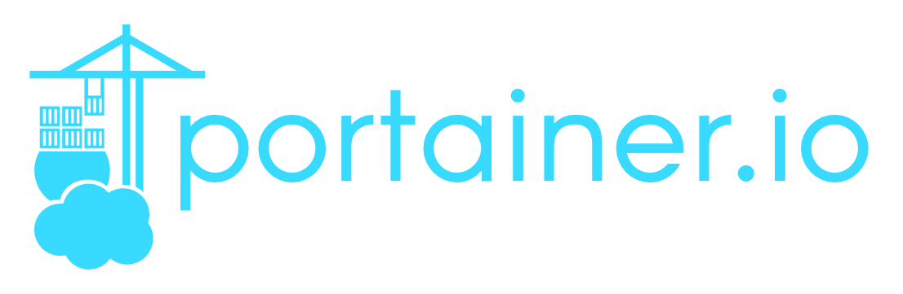

# Minik8s

## Description

Group project of SE3356 Cloud Operating System Design and Practice, Spring 2022.

## Structure

### Kubectl

`kubectl` is a command line tool that helps user controller `minik8s`. It's similar to `kubectl` in `Kubenetes`, but it's simplified and different in some commands. 
It is also based on `cobra`.

We support basic command like `kubectl get pods`, `kubectl apply -f xxx.yaml`. For more info, see directory `/kubectl/src/cmd`.

### Kubelet

The structure of `kubelet` in `minik8s` is similar to k8s, but it's greatly simplified.

#### Core: How to create a pod

Start an infra container first(default image is `registry.aliyuncs.com/google_containers/pause:3.6`). 
The infra container provides network namespace and volumes for all the other containers. 
So they can communicate with each other though `localhost` and share same volumes.

#### Support & References

+ Docker http client: [Moby](https://pkg.go.dev/github.com/docker/docker/client)
+ Docker api document: [Docker Engine API (v1.41)](https://docs.docker.com/engine/api/v1.41/#)
+ A good article on pod creation: [2.2 从 Pause 容器理解 Pod 的本质](https://k8s.iswbm.com/c02/p02_learn-kubernetes-pod-via-pause-container.html)

### Api-server

`Api-server` is the center of `minik8s`. It should expose REST apis for other components of the control plane. For fast development, we adopted a mature framework: `gin`

### Autoscaler

The pod resources monitor is based on `cAdvisor`, `Prometheus` and `Grafana`.

We recommend you to use grafana dashboard with UID `11277` and `893`.

Here is a good reference: [Build up Prometheus + Grafana + cAdvisor](https://blog.51cto.com/jiachuanlin/2538983)

#### Hint

Because all these components are running in containers, so you can't access other running component by simply
using `localhost`(Even if they are running in `host` network mode).
Please use the ip instead.

### GPU
Users only need to specify the scripts needed to compile cuda files and run them, and also the work directory. 

The cuda files(ended with `.cu`) will be recognized and uploaded to the π2.0 platform. The slurm script will be created automatically according to given parameters.

The jobs should be independent of each other, so we adopt a sidecar structure. The `gpu-server` will upload cuda files, compile them, create slurm script and finally submit the job by using command `sbatch`.

Since we don't have a good idea to be aware of the completion of submitted jobs(π2.0 supports email alert, but it's not suitable for this situation). So we temporarily adopt the strategy of polling(every 5 minutes). Once the job has been completed(can be known by using command `sacct`. If the job returned is `COMPLETED` in its `State` field, then it is completed), the `gpu-server` will download the output file and error file(`xxx.out`, `xxx.err`, specified by users). Users can then browse and download the results of jobs using `nginx-fileserver`.

#### π2.0 GPU Support
See:
+ https://github.com/SJTU-HPC/docs.hpc.sjtu.edu.cn
+ https://docs.hpc.sjtu.edu.cn/index.html
+ https://docs.hpc.sjtu.edu.cn/job/slurm.html
+ https://studio.hpc.sjtu.edu.cn/

## Tools

### Container Management
For `windows`, we have `Docker Desktop` to monitor the stats of all containers.
But in linux, we don't have such convenience.

Fortunately, `portainer` performs even better than `Docker Desktop`.
It can be deployed easily by using docker. You can type `./portainer-run.sh` to start the portainer.
Then you can access it at http://localhost:9000.

### Automatic deployment

`Jenkins` is super convenient for our project.

#### Q & A
Q: Why `nohup` does not work?

A: Killed by `Jenkins`. Try to add `BUILD_ID=dontKillMe` to the shell script.

Q: Why `go: command not found`?

A: Please add environment variables it needs manually to `Jenkins`.

