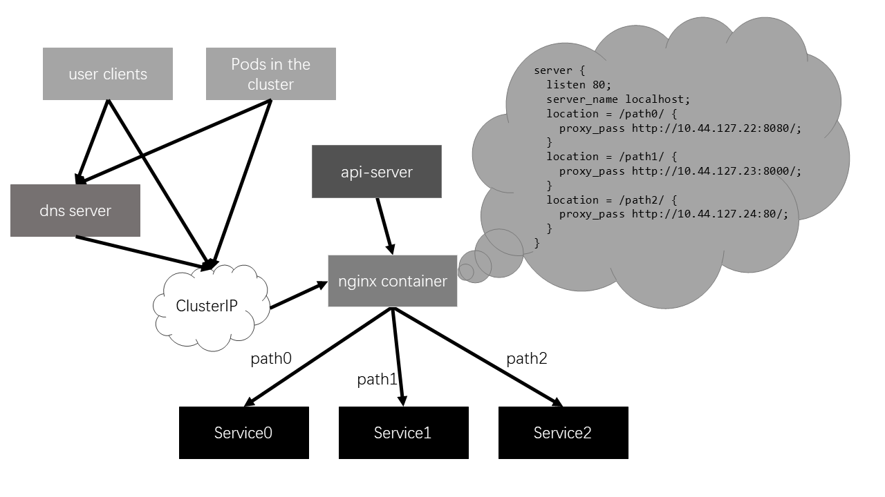

## Container Network

[Weave Net](https://www.weave.works/) can be used as a Docker plugin. A Docker network named `weave` is created by `weave launch`, which can be visible in the whole cluster. Under the Weave Net, containers can be allocated its `ClusterIP` in the cluster.

### How Minik8s allocates ClusterIP to Pods

- Run `weave launch <master_node_ip>` to start Weave Net and join master's Weave Net.
- Run `weave attach <subnet_ip> <container_id>` to allocate an IP in the subnet to specific container. Thanks to the `pause` container, we just need to allocate an IP to the `pause` container and then the whole `Pod` can be visited in the corresponding subnet in the cluster. For example, `weave attach 10.44.0.20/16 pod1_pause`. Then `pod1` can be visited through `10.44.0.20` in `10.44.0.0/16` in the cluster.
- Run `weave expose <subnet_ip>` to allocate an IP to host and expose host to the Weave Net, in order to visit `Pod`s from host machines.
- All `ClusterIP`s of `Pod`s are allocated by `api-server` and `kubelet` attaches `Pod`s to Weave Net.

## Service

`Proxy` watches the control plane for the addition and removal of `Service` and `Endpoint` objects.

### How proxy watches Service and Endpoint objects and then modifies the cluster network

- When a `Service` object is being created, `api-server` scans all `Endpoint` objects and finds all `Endpoint` objects with corresponding key-value selector. `Api-server` will publish these `Endpoint` objects and this `Service` object to the topic `serviceUpdateTopic` in `redis` to notify `proxy` a `Service` object has been created. `Proxy` will then start an `nginx` container, allocate `ClusterIP` of `Service` to the container and configure the `nginx.conf` file to map each `Service` port to the corresponding `Pod` ports (`Endpoint`s) and also do **load-balance** if there are **multiple** `Endpoint`s, for example, a `ReplicaSet` or some `Pod`s with the same key-value selector.

- When a `Service` object is being deleted, similar to `Service` creation, `api-server` will publish the `Service` objects to the topic `serviceUpdateTopic` in `redis`. `Proxy` will then shutdown the `Service`'s' `nginx` container.
- When an `Endpoint` object is being created or deleted, `api-server` scans all `Service` objects and finds all `Service` objects with corresponding key-value selector. `Api-server` will publish `Endpoint` objects and `Service` objects to the topic `endpointUpdateTopic` in `redis` to notify `proxy` an `Endpoint` object has been created or deleted. `Proxy` will update `nginx.conf` files and apply to corresponding `nginx` containers.

### How Pods or users visit Services in the cluster

- All `Pod`s and users in the cluster will join the Weave Net first. Then the `Service`'s `ClusterIP` (the `ClusterIP` of `nginx` container) is available to all Pods and users.

## DNS

[CoreDNS](https://coredns.io/manual/toc/)  is a DNS server, which can be configured through its `Corefile`.

### How Minik8s maps paths to Services and allocates domain name

- During initialization of Minik8s, Minik8s will redirect the nameserver of host machines and containers to CoreDNS through configuring `/etc/resolv.conf` and `/etc/docker/daemon.json`.
- Minik8s use `nginx` containers to map paths to Services. For a `DNS` object, minik8s will start an `nginx` container, allocate an IP, and then configure the `nginx.conf` file to map each path to the corresponding `Service` ports. Then Minik8s will add a name-IP(the `nginx` container IP) mapping to CoreDNS.

### How Pods or users visit Service through its domain name in the cluster

- `Pod`s and users in the cluster will ask nameserver for name-IP mapping, and then visit the corresponding `nginx` container. `nginx` container will redirect the path request to `ServiceIp:ServicePort` to visit `Service`.

