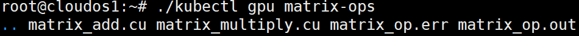

# Command Guide and Reference Manual

## kubectl apply

+ `kubectl apply -f [filename]`:

  If you want to create api object in a declarative way, you can use this command.

  For example, if you have a pod template yaml file called `pod.yaml` in current directory, then you can
  type `kubectl apply -f ./pod.yaml` to create a pod according to your specified template.

## kubectl get

+ `kubectl get pod [pod name]`

  This command will show the status of the given pod in a table.

  For example, if you have a pod called `example` in the default namespace, then you can check its status
  by `kubectl get pod example`(since it's in the default namespace, so the namespace can be omitted. Otherwise, you must
  type `namespace/name` to specify a pod).

  

  
Example

  
  

+ `kubectl get pods`

  This command will show the status of all pods(in all namespaces) in a table.

  

  
Example

  
  

+ `kubectl get node [node name]`

  This command will show the status of the given node in a table.
  

  
Example

  
  

+ `kubectl get nodes`

  This command will show the status of all nodes(in all namespaces) in a table.
  

  
Example

  
  

+ `kubectl get rs [replicaSet name]`
  This command will show the status of the given replicaSet in a table.
  

  
Example

  
  

+ `kubectl get rss`

  This command will show the status of all replicaSets(in all namespaces) in a table.
  

  
Example

  
  

+ `kubectl get hpa [hpa name]`
  This command will show the status of the given horizontal pod autoscaler in a table.
  

  
Example

  
  

+ `kubectl get hpas`

  This command will show the status of all horizontal pod autoscalers(in all namespaces) in a table.
  

  
Example

  
  

+ `kubectl get wf [workflow name]`
  This command will show the status of the given workflow in a table.
  

  
Example

  
  

+ `kubectl get wfs`

  This command will show the status of all workflows(in all namespaces) in a table.
  

  
Example

  
  

## kubectl delete

+ `kubectl delete [api object type] [name]`
  

  
Example

  
  

## kubectl autoscale

+ `kubectl autoscale [hpa name]`

| Parameter | Description                                                                          | Example      |
|-----------|--------------------------------------------------------------------------------------|--------------|
| target    | Required. Specify the target of hpa                                                  | --target=rs1 |
| min       | Optional, default value is 1. Specify the minimum number of replicas                 | --min=1      |
| max       | Optional, default value is 1. Specify the maximum number of replicas                 | --max=4      |
| c         | Optional. Choose cpu utilization as metrics, and the given value as its benchmark    | -c 0.5       |
| m         | Optional. Choose memory utilization as metrics, and the given value as its benchmark | -m 0.5       |
| i         | Optional, default value is 15. Specify the interval of scaling.                      | -i 30        |

This command will create a hpa according to given parameters. Notice that if you specify both cpu and memory metrics,
the hpa controller will choose cpu(cpu has higher priority).

You can also create a hpa in a declarative way: `kubectl apply -f hpa.yaml`.

We recommend you to use `kubectl autoscale` command, for it is more obvious.
  

  
Example

  
  

## kubectl reset

This command is for test only(of course you can also feel free to use it). It will remove all the K-V pairs stored
in `etcd`, thus resetting the status of the whole system.

## kubectl gpu

+ `kubectl gpu [gpu job name] -d [directory] -f [file to download]`

  This command will list or download the files throw the `nginx-fileserver`. Files in blue colors are directories.

  `-d` flag stands for the directory to hold the download files(only works when flag `-f` is used).

  `-f` flag stands for the file you want to download. It will be downloaded through `GET` http request into the
  directory you have specified in flag `-d`.

  If you don't use any flags, this command will list the files, just like `ls` command.
  

  
List files example

  
  

  

  
Download files example

  
You can see that the file <code>matrix-op.out</code> has been successfully downloaded to the current directory.

  
  

## kubectl func

+ `kubectl func add -f [function name] -p [function code path]`

  This command will register a function to the `knative`.

  `-f` flag stands for the name of the function.

  `-p` flag stands for the filepath of the code.

  

  
Example

  
  

+ `kubectl func rm -f [function name]`

  This command will remove the function and its instances(pods and replicaSet).
  

  
Example

  
  

+ `kubectl func update -f [function name] -p [function code path]`

  This command will update a function to the `knative`.

## kubectl trigger

+ `kubectl trigger [function name] -d [function params json]`

  This command will call a serverless function through `http trigger`.

  `-d` flag stands for the json form of parameters the function needs.

  

  
Example

  
  

## kubectl wf

+ `kubectl wf apply -f [workflow.json filepath]`

  This command will create a workflow in a declarative way.

  `-f` flag stands for the `${workflow_name}.json` filepath.

  

  
Example

  
  

+ `kubectl wf rm [workflow name]`

  This command will remove the specified workflow.
  

  
Example

  
  

## kubectl label

+ `kubectl label nodes [node name] [label]`

  This command can label a node with given labels.
  

  
Example

  
  

## kubectl cfg

+ `kubectl cfg sched=[schedule strategy]`

  This command can dynamically change the schedule strategy.

| strategy | Description                                               |
|----------|-----------------------------------------------------------|
| min-pods | Schedule pod to the node with minimum number of pods      | 
| max-pods | Schedule pod to the node with maximum number of pods      | 
| min-cpu  | Schedule pod to the node with minimum cpu utilization     | 
| min-mem  | Schedule pod to the node with minimum memory utilization  | 
| random   | Schedule pod to a random node                             |